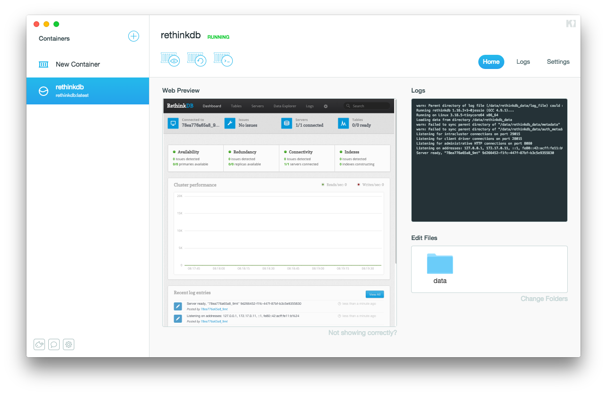
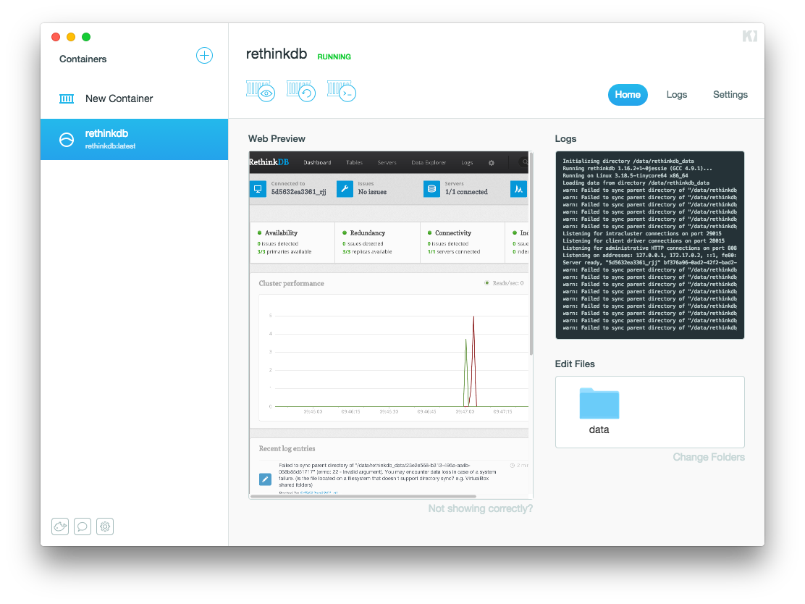

<!--[metadata]>
+++
title = "Creating a Local RethinkDB Database for Development"
description = "Tutorial demonstrating the setup of an RethinkDB database for development"
keywords = ["docker, documentation, about, technology, kitematic, gui, rethink,  tutorial"]
[menu.main]
parent="smn_workw_kitematic"
weight=3
+++
<![end-metadata]-->

# Kitematic Tutorial: Creating a Local RethinkDB Database for Development

In this tutorial, you will:

- Create a RethinkDB Container for Development
- (Advanced) Clone a small Node.js application and write data into RethinkDB.

### Setting up RethinkDB in Kitematic

First, if you haven't yet done so, [download and start
Kitematic](index.md). Once open, the app should look like
this:

Click on the _Create_ button of the `rethinkdb` image listing in the recommended
list as shown above. This will download & run a RethinkDB container within a few
minutes. Once it's done, you'll have a local RethinkDB database up and running.

Let's start using it to develop a node.js app. For now, let's figure out which
IP address and port RethinkDB is listening on. To find out, click the `Settings`
tab and then the `Ports` section:

You can see there that for RethinkDB port `28015`, the container is listening on
host `192.168.99.100` and port `49154` (in this example - ports may be different
for you). This means you can now reach RethinkDB via a client driver at
`192.168.99.100:49154`. Again, this IP address may be different for you.

### (Advanced) Saving Data into RethinkDB with a local Node.js App

Now, you'll create the RethinkDB example chat application running on your local
OS X system to test drive your new containerized database.

First, if you don't have it yet, [download and install
Node.js](http://nodejs.org/).

> **Note**: this example needs Xcode installed. We'll replace it with something
> with fewer dependencies soon.

In your terminal, type:

     $ export RDB_HOST=192.168.99.100 # replace with IP from above step
     $ export RDB_PORT=49154 # replace with Port from above step
     $ git clone https://github.com/rethinkdb/rethinkdb-example-nodejs-chat
     $ cd rethinkdb-example-nodejs-chat
     $ npm install
     $ npm start

Now, point your browser to `http://localhost:8000`. Congratulations, you've
successfully used a RethinkDB container in Kitematic to build a real-time chat
app. Happy coding!

